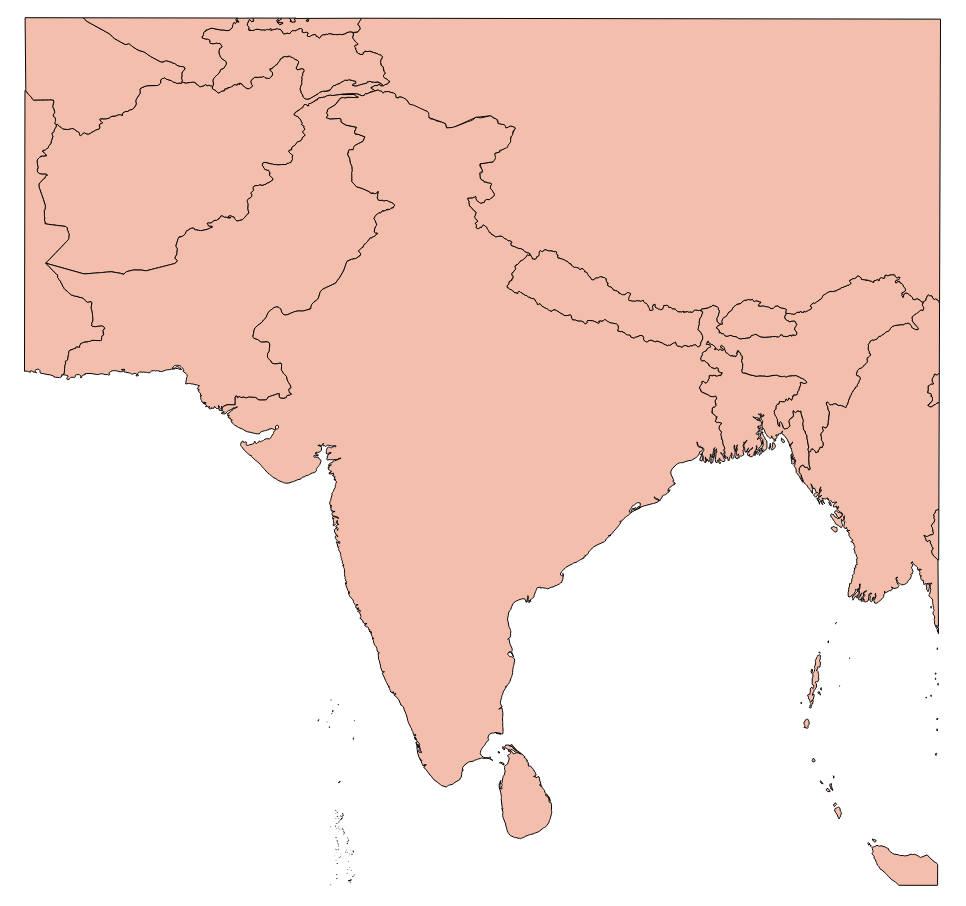

This is the shapefile for South Asia with the borders drawn as the Indian government sees them. The repo also has a geojson.

Created from [naturalearthdata](https://www.naturalearthdata.com/downloads/50m-cultural-vectors/) shapefiles, released under an [unlicense](http://unlicense.org/).

